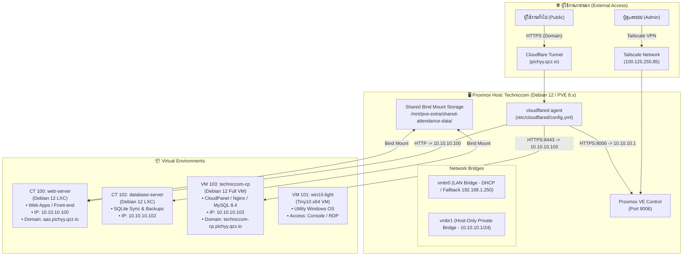

# LBtech Techniccom - Proxmox Server Infrastructure Documentation 🖥️🌐

คลังเอกสารและคู่มือการดูแลระบบเซิร์ฟเวอร์ **Techniccom** (Proxmox VE Hypervisor) สำหรับบริหารจัดการ Containers (LXC), Virtual Machines (VMs), CloudPanel, ระบบเครือข่าย VPN (Tailscale) และช่องทางเข้าถึงผ่าน Cloudflare Tunnel

---

## 📑 สารบัญเอกสาร (Documentation Index)

| เอกสาร | รายละเอียด |
| :--- | :--- |
| 🚀 [**คู่มือการเชื่อมต่อและเข้าใช้งาน (how_to_connect.md)**](how_to_connect.md) | วิธีเข้าใช้งาน Proxmox VE, CloudPanel, SSH, Tailscale VPN และ Cloudflare Tunnel สำหรับผู้ใช้ทั่วไปและผู้ดูแล |
| 🏗️ [**โครงสร้างระบบเซิร์ฟเวอร์ (server_infrastructure.md)**](server_infrastructure.md) | สเปกฮาร์ดแวร์/ซอฟต์แวร์, การจัดสรร CPU/RAM/Disk, การตั้งค่าเครือข่าย (`vmbr0`, `vmbr1`), Bind Mount และ Storage |
| 🎛️ [**คู่มือระบบ CloudPanel VM 103 (CLOUDPANEL_VM_103.md)**](CLOUDPANEL_VM_103.md) | รายละเอียดเครื่องเสมือน CloudPanel, Nginx, PHP-FPM, MySQL 8.4, การกำหนด Ingress Route และการจัดการเว็บไซต์ |
| 🔐 [**ข้อมูลบัญชีและรหัสผ่าน (credentials.md)**](credentials.md) | ทะเบียนบัญชีผู้ใช้งาน, รหัสผ่าน, พอร์ตบริการ, คำสั่ง SSH และ Static IP *(เอกสารภายใน)* |
| 📄 [**เอกสารคู่มือฉบับทางการ (PDF Handbooks)**](output/pdf/) | ไฟล์คู่มือรูปแบบ PDF พร้อมพิมพ์/ส่งมอบ: <br/>• `คู่มือส่งมอบและดูแลระบบเซิร์ฟเวอร์.pdf`<br/>• `คู่มือการใช้งานและดูแลระบบเซิร์ฟเวอร์.pdf` |

---

## 🏛️ แผนผังสถาปัตยกรรมระบบ (System Architecture)



---

## 📊 ตารางสรุปข้อมูลเครื่องและบริการ (System Inventory)

| ID / Node | ประเภท | ชื่อระบบ | OS | RAM / Core | IP ภายใน (vmbr1) | ช่องทางภายนอก (Domain / VPN) | หน้าที่หลัก |
| :--- | :--- | :--- | :--- | :--- | :--- | :--- | :--- |
| **Host** | Host | `Techniccom` | Proxmox 8.x | ตามเครื่องจริง | `10.10.10.1` | `techniccom-pve.pichyy.qzz.io`<br/>Tailscale: `100.125.250.85` | แม่ข่าย Hypervisor ควบคุม VM/LXC ทั้งหมด |
| **CT 100** | LXC | `web-server` | Debian 12 | 4 GB / 1 vCPU | `10.10.10.100` | `http://aas.pichyy.qzz.io` | บริการเว็บแอปพลิเคชันหน้าร้าน |
| **CT 102** | LXC | `database-server` | Debian 12 | 512 MB / 1 vCPU | `10.10.10.102` | - *(ใช้งานภายใน)* | พื้นที่จัดเก็บ SQLite และสำรองข้อมูล |
| **VM 103** | VM | `techniccom-cp` | Debian 12 | 4-8 GB / 2 vCPU | `10.10.10.103` | `https://techniccom-cp.pichyy.qzz.io` | แผงควบคุม CloudPanel, Nginx, MySQL 8.4 |
| **VM 101** | VM | `win10-light` | Tiny10 x64 | 2 GB / 1 vCPU | DHCP | - *(เข้าผ่าน Console/RDP)* | ระบบปฏิบัติการ Windows 10 ขนาดเบา |

---

## ⚡ สรุปช่องทางเข้าใช้งานหลัก (Quick Access)

### 1. เข้าใช้งานผ่าน Web Interface
* **Proxmox VE Web UI (Cloudflare):** [https://techniccom-pve.pichyy.qzz.io](https://techniccom-pve.pichyy.qzz.io)
* **Proxmox VE Web UI (Tailscale VPN):** [https://100.125.250.85:8006](https://100.125.250.85:8006)
* **Proxmox VE Web UI (Local LAN Fallback):** [https://192.168.1.250:8006](https://192.168.1.250:8006)
* **CloudPanel Admin (External Domain):** [https://techniccom-cp.pichyy.qzz.io](https://techniccom-cp.pichyy.qzz.io)
* **Web Application (External Domain):** [http://aas.pichyy.qzz.io](http://aas.pichyy.qzz.io)

### 2. เข้าใช้งานผ่าน SSH (Terminal / PowerShell)
```bash
# Proxmox Host (ผ่าน Tailscale)
ssh tc-admin@100.125.250.85

# CT 100 Web Server (เข้าผ่าน Host)
ssh root@10.10.10.100

# CT 102 Database Server (เข้าผ่าน Host)
ssh root@10.10.10.102

# VM 103 CloudPanel Server (เข้าผ่าน Host)
ssh tc-admin@10.10.10.103
```

---

## 🛠️ คำสั่งพื้นฐานสำหรับผู้ดูแลระบบ (Useful CLI Commands)

รันคำสั่งเหล่านี้บน **Proxmox Host**:

```bash
# ตรวจสอบรายการและสถานะของ VM และ LXC
qm list
pct list

# สั่งเปิด / ปิด / รีสตาร์ท VM 103 (CloudPanel)
qm start 103
qm shutdown 103
qm reboot 103

# สั่งเปิด / ปิด / รีสตาร์ท CT 100 (Web Server)
pct start 100
pct shutdown 100
pct reboot 100

# เปิด Console เข้าใช้งาน VM / CT โดยตรง
qm terminal 103
pct enter 100

# ตรวจสอบสถานะการทำงานของ Cloudflare Tunnel
systemctl status cloudflared
journalctl -u cloudflared -n 50 --no-pager

# ตรวจสอบการใช้งานพื้นที่จัดเก็บข้อมูล (Disk Usage)
df -h
```

---

## 🔒 แนวทางความปลอดภัย (Security Best Practices)

1. **ไม่เปิดเผยรหัสผ่านและ Secret ในพื้นที่สาธารณะ**: บันทึกและส่งต่อข้อมูลผ่าน Password Manager ที่ปลอดภัยเท่านั้น
2. **ใช้ Tailscale VPN สำหรับการจัดการระบบ**: หลีกเลี่ยงการเปิดพอร์ต WebUI (8006) หรือ SSH (22) ออกสู่ Internet โดยตรง
3. **สำรองข้อมูล (Backup) และ Snapshot**: สร้าง Snapshot หรือ Backup ก่อนทำการอัปเดตระบบปฏิบัติการ, แพ็กเกจ Nginx/PHP หรือ CloudPanel ทุกครั้ง
4. **ตรวจสอบ Bind Mount**: ตรวจสอบพื้นที่และการล็อกไฟล์ของ `/mnt/pve-extra/shared-attendance-data/` ก่อนแก้ไขฐานข้อมูล SQLite

---

*จัดทำและปรับปรุงล่าสุด: สิงหาคม 2569*
