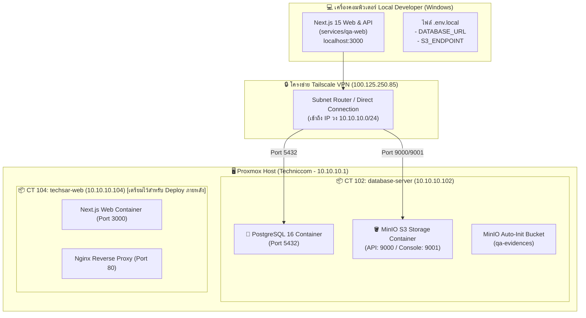

# ผังโครงสร้างเซิร์ฟเวอร์และการเชื่อมต่อ (Server & Network Architecture)

ระบบประกันคุณภาพการศึกษาและรายงานการประเมินตนเอง (TechSAR) แบ่งการทำงานออกเป็น Service ย่อย โดยเชื่อมต่อกับ Proxmox Server (`Techniccom`) ดังนี้:

## สรุปตาราง IP และพอร์ตเชื่อมต่อ

| Service | ที่อยู่ของระบบ (Location) | IP / Hostname | พอร์ต | หน้าที่หลัก |
| :--- | :--- | :--- | :--- | :--- |
| **PostgreSQL 16** | CT 102 (`database-server`) | `10.10.10.102` | `5432` | ฐานข้อมูลหลัก (Prisma ORM) |
| **MinIO API** | CT 102 (`database-server`) | `10.10.10.102` | `9000` | S3-Compatible Object Storage สำหรับเก็บเอกสารร่องรอย SAR |
| **MinIO Console** | CT 102 (`database-server`) | `10.10.10.102` | `9001` | แผงควบคุม MinIO Web UI |
| **Next.js Web App** | Local Machine (ช่วง Dev) | `localhost` | `3000` | เว็บแอปพลิเคชันและ API Routes |
| **Web Server (Prod)**| CT 104 (`techsar-web`) | `10.10.10.104` | `80, 3000` | รองรับการ Deploy ในอนาคต |
